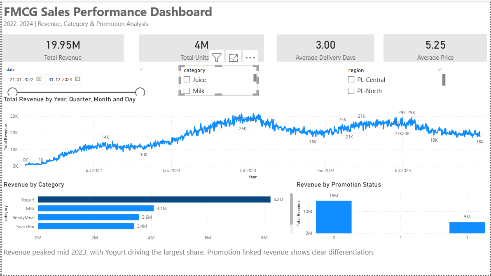

# FMCG Jarvis

**AI-Powered Business Analytics Assistant for Fast-Moving Consumer Goods**

An end-to-end analytics system that combines SQL-based reporting, machine learning predictions, and what-if simulations into a unified conversational interface. Designed for FMCG decision-makers who need actionable insights from sales and supply chain data.

---

## Table of Contents

- [Project Overview](#project-overview)
- [System Architecture](#system-architecture)
- [Features](#features)
- [Machine Learning Pipeline](#machine-learning-pipeline)
- [Power BI Dashboard](#power-bi-dashboard)
- [Project Structure](#project-structure)
- [Setup Instructions](#setup-instructions)
- [Author](#author)

---

## Project Overview

### Business Context

Fast-Moving Consumer Goods companies generate vast amounts of transactional data across products, regions, and time periods. FMCG Jarvis transforms this data into business intelligence by answering questions across three analytics dimensions:

| Analytics Type | Purpose | Example |
|----------------|---------|---------|
| **Descriptive** | Understand what happened | Which category generated the highest revenue last year? |
| **Predictive** | Forecast what will happen | What is the expected daily demand for this product? |
| **Prescriptive** | Simulate what could happen | How would a 20% stock reduction impact sales? |

### Technical Summary

The application is built with a modular architecture that separates data access, machine learning, and presentation layers. Users interact through a Streamlit web interface that routes questions to the appropriate analytics handler.

**Tech Stack:**
- **Backend:** Python, SQLite, SQLAlchemy
- **Machine Learning:** XGBoost, Pandas, scikit-learn
- **Frontend:** Streamlit
- **Visualization:** Power BI

---

## System Architecture

The system follows a layered architecture where user queries flow through a central dispatcher to specialized handlers:

`
+-------------------------------------------------------------+
|                    STREAMLIT INTERFACE                      |
|                        (app.py)                             |
+-----------------------------+-------------------------------+
                              |
                              v
+-------------------------------------------------------------+
|                   JARVIS DISPATCHER                         |
|                     (jarvis.py)                             |
|         Routes questions to appropriate handlers            |
+-----------+------------------+------------------+------------+
            |                  |                  |
            v                  v                  v
    +-------------+    +--------------+    +--------------+
    |  SQL Layer  |    |   ML Layer   |    |  NLP Layer   |
    |             |    |              |    |              |
    |  Aggregate  |    |   Predict    |    |   Intent     |
    |  Filter     |    |   Simulate   |    |   Detection  |
    |  Join       |    |   Explain    |    |              |
    +------+------+    +-------+------+    +--------------+
           |                   |
           v                   v
    +-------------+    +--------------+
    |   SQLite    |    |   XGBoost    |
    |  Database   |    |    Model     |
    +-------------+    +--------------+
`

### Component Responsibilities

| Component | File | Responsibility |
|-----------|------|----------------|
| Application Entry | app.py | Streamlit UI, health checks, session management |
| Dispatcher | jarvis.py | Question routing, response formatting |
| SQL Handler | jarvis_sql.py | Database queries, aggregations, filtering |
| ML Handler | jarvis_ml.py | Predictions, simulations, feature engineering |
| NLP Handler | jarvis_nlp.py | Intent detection for free-text queries |

---

## Features

### Descriptive Analytics

SQL-powered queries against the FMCG database:

- Total units sold with year filtering
- Average daily sales metrics
- Top-performing categories, brands, regions, and channels
- Promotion effectiveness analysis (promotion vs. non-promotion uplift)
- Stock availability correlation with sales performance

### Predictive Analytics

Machine learning predictions using the trained XGBoost model:

- Expected daily demand under current market conditions
- Demand forecast with active promotions
- Baseline demand forecast without promotions

### Prescriptive Analytics

What-if simulations for scenario planning:

- **Stock Adjustment:** Impact of increasing or decreasing stock levels by 20%
- **Delivery Optimization:** Effect of delivery delay changes on demand
- **Promotion Strategy:** Revenue implications of enabling or disabling promotions
- **Feature Sensitivity:** Identification of key demand drivers through importance analysis

---

## Machine Learning Pipeline

### Training Phase

The model is trained offline using historical sales data. The training pipeline includes:

1. **Data Preparation:** Join sales transactions with product and market dimensions
2. **Feature Engineering:** Create derived features such as stock ratio and temporal indicators
3. **Target Transformation:** Apply log transformation to handle skewed demand distribution
4. **Model Training:** Fit XGBoost regressor with hyperparameter tuning
5. **Validation:** Evaluate on held-out test set using RMSE and MAE metrics
6. **Serialization:** Export trained model and feature sample for inference

### Feature Schema

The model uses the following features for demand prediction:

| Feature | Description |
|---------|-------------|
| product_id | Encoded product identifier |
| market_id | Encoded market identifier |
| year | Calendar year |
| promotion_flag | Binary indicator (0 = no promotion, 1 = promotion active) |
| price | Unit selling price |
| discount_pct | Applied discount percentage |
| stock_available | Current inventory units |
| delivery_delay_days | Expected delivery time in days |
| stock_ratio | Normalized stock level (stock / max stock per product-market) |

### Inference and Deployment

At runtime, the application loads the serialized model and ensures feature alignment between training and inference:

- Feature columns are reordered to match the training schema
- Missing features raise explicit errors rather than failing silently
- Predictions are inverse-transformed from log scale to original units

---

## Power BI Dashboard

A companion Power BI dashboard provides executive-level visualization of sales performance metrics.

### Dashboard Components

| Visualization | Insight |
|---------------|---------|
| Revenue Trends | Year-over-year revenue analysis from 2022 to 2024 |
| Category Performance | Comparative performance across product categories |
| Promotion Impact | Revenue comparison between promotional and non-promotional periods |
| Regional Filtering | Interactive slicers for region-specific analysis |

---

## Project Structure

`
fmcg-jarvis/
|-- app.py                      # Streamlit application entry point
|-- fmcg_jarvis/
|   |-- __init__.py
|   |-- jarvis.py               # Central dispatcher and handlers
|   |-- jarvis_sql.py           # SQL query execution layer
|   |-- jarvis_ml.py            # ML prediction and simulation layer
|   +-- jarvis_nlp.py           # Intent detection module
|-- tools/
|   |-- xgb_model.pkl           # Trained XGBoost model
|   +-- X_test.pkl              # Feature sample for simulations
|-- data/
|   +-- fmcg_data.db            # SQLite database
|-- notebooks/
|   +-- main.ipynb              # Data pipeline and model training
|-- fmcg_dashboard.png          # Power BI dashboard screenshot
|-- requirements.txt
+-- README.md
`

---

## Setup Instructions

### Prerequisites

- Python 3.10 or higher
- pip package manager

### Installation

1. **Clone the repository**

`ash
git clone https://github.com/your-username/fmcg-jarvis.git
cd fmcg-jarvis
`

2. **Create and activate a virtual environment**

`ash
python -m venv venv

# On Windows
venv\Scripts\activate

# On macOS/Linux
source venv/bin/activate
`

3. **Install dependencies**

`ash
pip install -r requirements.txt
`

### Dependencies

`
streamlit>=1.28.0
pandas>=2.0.0
numpy>=1.24.0
sqlalchemy>=2.0.0
xgboost>=3.0.0
scikit-learn>=1.3.0
`

### Running the Application

`ash
streamlit run app.py
`

The application will launch in your default browser at http://localhost:8501.

### Verifying the Installation

The application performs automatic health checks on startup, validating:

- Database connectivity and schema integrity
- ML model loading and prediction capability
- Feature data availability for simulations

---

## Author

This project demonstrates end-to-end data science and machine learning engineering capabilities, including:

- Relational database design and SQL analytics
- Supervised learning with XGBoost for demand forecasting
- Feature engineering and train-inference parity
- Interactive application development with Streamlit
- Business intelligence visualization with Power BI

---

## License

This project is available for educational and portfolio demonstration purposes.
